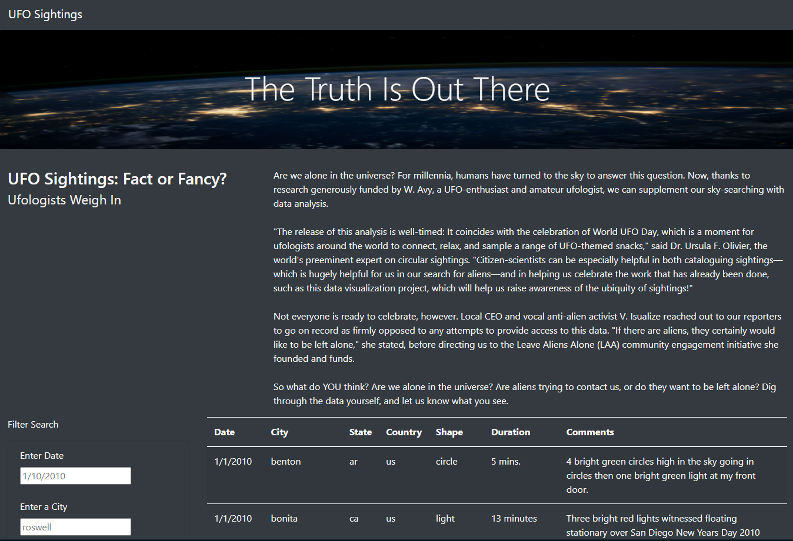
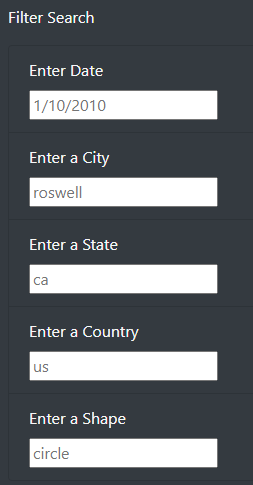
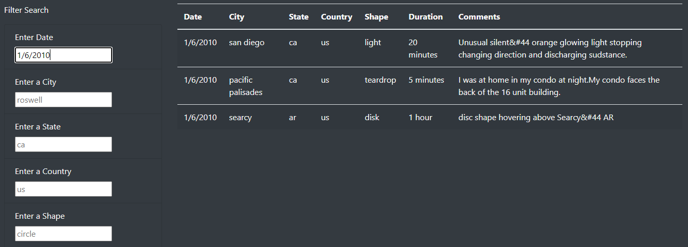
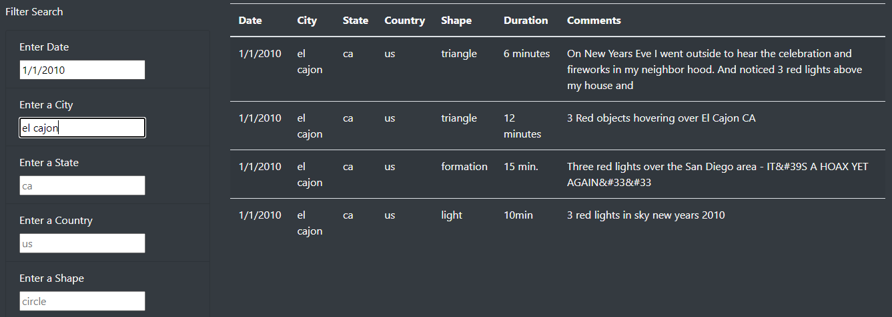
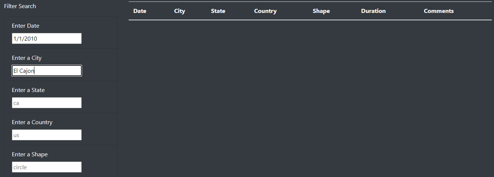
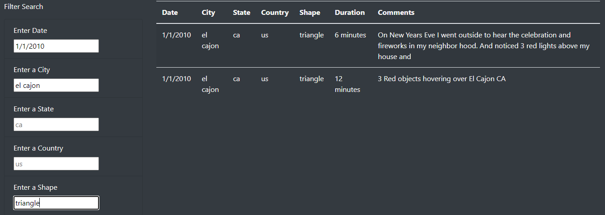
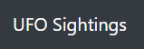
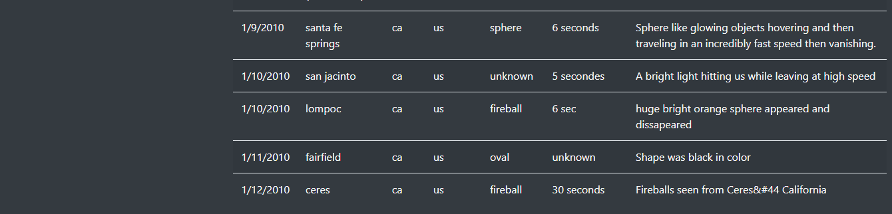

# UFOs

## Overview of the analysis

The goal of this project is to use knowledges about JavaScript, HTML, CSS, Bootstrap to build a dynamic webpage. The main advantage of a dynamic webpage - it accepts user inputs and visually adjusts to reflect that interaction. While working on this we should be able to create filters on a table and to present the data that is visually appealing and interactive.

## Results

The Truth Is Out There - is a dynamic webpage about UFOs sightings in different locations. It contains a lot of data that is presented in a table. Filters were created to be able to search specific information based on different criteria.



On a screenshot below we can see that it is possible to filter data by date, city, state, country and even a shape. It is important to know that filter is case sensitive. As all our original data was written lower case, we need to use filter the same way. The placeholder is an example of data to search, so users know both the location of where to type the criteria and the format to use:



It is possible to use one criterion or a mix of them. To use it, it is required to type necessary  information in the input field and hit Enter. After that filter will immediately show to the user information that he is looking for.

For example, we need to see all sightings that happened on 1/6/2010. Let’s type this in a "Enter Date" input field and hit Enter. Below is the result of it:



Now let’s change the date to 1/1/2010 and add a city El Cajon. Since we have an example of the format to use - lets type "el cajon" lower case:



If we try to change the search to "El Cajon" instead of "el cajon" - there will be no data shown:



Since El Cajon located in CA, USA there is no need to use filters by state and country, so let’s just add a shape and hit Enter:



There are two ways to see back the whole table of data - remove manually all criteria from input fields or scroll up to the beginning of the webpage (navigation bar) and click on the name "UFO Sightings" - this will automatically refresh the page to its original view. This is possible because when building a NavBar in the HTML we added an href that points to the index.html file. When a user clicks on that link, the page will reload and the default unfiltered table will appear, ready for new input. 

```
<!-- Build the Navbar (navigation bar) -->
<nav class="navbar navbar-dark bg-dark navbar-expand-lg">
    <a class="navbar-brand" href="index.html">UFO Sightings</a>
</nav>
```



## Summary

As a drawback of this new design, I really miss the "Filter Table" button that was applying our filter criteria to the data in the table. The filter is working perfectly even without this button as user just need to hit Enter, but it is more visible and user-friendly when you have an actual button to start the searching process.

As for further developments:
1. As a consequence of the above disadvantage - I'd like to bring back the "Filter Table" button that will apply our filter criteria to the data in the table.

2. If user needs to filter data, for example, by CA state only - he will get a lot of rows of data. When checking the result he will scroll the webpage more and more down, but the Filter Search form will stay on the same place right after the article and user won't see it anymore from the bottom of the webpage. So, to apply additional filter criteria user will need to scroll up to find a Filter Search form. It would be nice to make the Filter Search form fixed, so this part of the webpage won't be scrolled and will always be in front of the user's eyes. As of now the bottom of the webpage looks like below - no Filter Search form visible:



3. This is great that user can apply filter by entering his criteria in the input field. But it would be more comfortable to add drop-down list in each filter criteria so user can see what options he can choose from.

4. To reload the webpage and bring back the default unfiltered table user can either remove all filter criteria or click on a "UFO Sightings" in a navigation bar. Again, it would be more user-friendly to add a "Clear Filter" button to do the same action as clickong on "UFO Sightings". The result is the same but it will be clearer for the end-user.